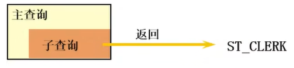
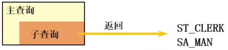
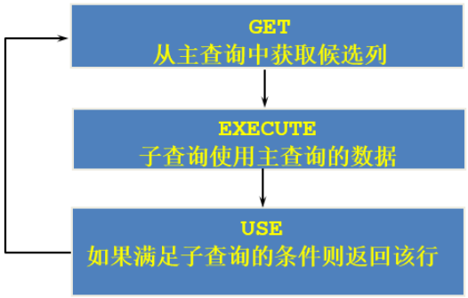
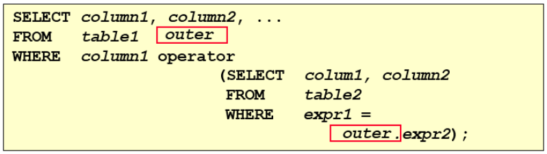

**<span style="font-size: 35px;">🐉 MySQL 基础篇 - 子查询</span>**

---

# 子查询

## 1. 基本使用

+ 子查询的基本语法结构：


+ 子查询（内查询）在主查询之前一次执行完成。
+ 子查询的结果被主查询（外查询）使用 。
+ **注意事项**
  + 子查询要包含在括号内
  + 将子查询放在比较条件的右侧
  + 单行操作符对应单行子查询，多行操作符对应多行子查询

## 2. 子查询的分类

**分类方式1：**

我们按内查询的结果返回一条还是多条记录，将子查询分为 单行子查询 、 多行子查询 。

+ 单行子查询



+ 多行子查询



**分类方式2：**

我们按内查询是否被执行多次，将子查询划分为 相关(或关联)子查询 和 不相关(或非关联)子查询 。 

子查询从数据表中查询了数据结果，如果这个数据结果只执行一次，然后这个数据结果作为主查询的条件进行执行，那么这样的子查询叫做不相关子查询。 

同样，如果子查询需要执行多次，即采用循环的方式，先从外部查询开始，每次都传入子查询进行查询，然后再将结果反馈给外部，这种嵌套的执行方式就称为相关子查询。

## 3. 单行子查询

### 1) 单行比较操作符

| 操作符 | 含义                     |
| ------ | ------------------------ |
| =      | equal to                 |
| >      | greater than             |
| >=     | greater than or equal to |
| <      | less than                |
| <=     | less than or equal to    |
| <>     | not equal to             |

### 2) 代码示例

* 题目：返回job_id与141号员工相同，salary比143号员工多的员工姓名，job_id和工资

```mysql
SELECT last_name, job_id, salary
FROM eployees
WHERE job_id = (
	SELECT job_id
	FROM eployees
    WHERE employee_id = 141
)
AND salary > (
	SELECT salary
	FROM eployees
    WHERE employee_id = 143
);
```

* 题目：查询与141号或174号员工的manager_id和department_id相同的其他员工的employee_id， manager_id，department_id

```mysql
# 实现方式一：不成对比较
SELECT employee_id, manager_id, department_id
FROM employees
WHERE manager_id IN
        (SELECT manager_id
        FROM employees
        WHERE employee_id IN (174,141))
AND department_id IN
        (SELECT department_id
        FROM employees
        WHERE employee_id IN (174,141))
AND employee_id NOT IN(174,141);

# 实现方式二：成对比较
SELECT employee_id, manager_id, department_id
FROM employees
WHERE (manager_id, department_id) IN
        (SELECT manager_id, department_id
        FROM employees
        WHERE employee_id IN (141,174))
AND employee_id NOT IN (141,174);
```

* 题目：查询最低工资大于50号部门最低工资的部门id和其最低工资

```mysql
SELECT department_id, MIN(salary)
FROM employees
GROUP BY department_id
HAVING MIN(salary) >
            (SELECT MIN(salary)
            FROM employees
            WHERE department_id = 50);
```

### 3) CASE中的子查询

题目：显式员工的employee_id,last_name和location。其中，若员工department_id与location_id为1800 的department_id相同，则location为’Canada’，其余则为’USA’。

```mysql
SELECT employee_id, last_name,
    (CASE department_id
    WHEN
        (SELECT department_id FROM departments
        WHERE location_id = 1800)
    THEN 'Canada' ELSE 'USA' END) location
FROM employees;
```

### 4) 子查询中的空值问题

```mysql
SELECT last_name, job_id
FROM employees
WHERE job_id =
(SELECT job_id
FROM employees
WHERE last_name = 'Haas');
```

> 子查询不返回任何行

### 5) 非法使用子查询

```mysql
SELECT employee_id, last_name
FROM employees
WHERE salary =
(SELECT MIN(salary)
FROM employees
GROUP BY department_id);
```

> 多行子查询使用单行比较符

## 4. 多行子查询

* 也称为集合比较子查询
* 内查询返回多行
* 使用多行比较操作符

### 1) 多行比较操作符

| 操作符 | 含义                                                     |
| ------ | -------------------------------------------------------- |
| IN     | 等于列表中的任意一个                                     |
| ANY    | 需要和单行比较操作符一起使用，和子查询返回的某一个值比较 |
| ALL    | 需要和单行比较操作符一起使用，和子查询返回的所有值比较   |
| SOME   | 实际上是ANY的别名，作用相同，一般常使用ANY               |

### 2) 代码示例

* 题目：返回其它job_id中比job_id为‘IT_PROG’部门任一工资低的员工的员工号、姓名、job_id 以及salary

```mysql
SELECT employee_id, last_name, job_id, salary
FROM employees
WHERE job_id <> 'IT_PROG' 
AND salary < ANY(
	SELECT salary
    FROM emplyees
    WHERE job_id = 'IT_PROG'
);
```

* 题目：查询平均工资最低的部门id

```mysql
#方式1：
SELECT department_id
FROM employees
GROUP BY department_id
HAVING AVG(salary) = (
        SELECT MIN(avg_sal)
        FROM (
            SELECT AVG(salary) avg_sal
            FROM employees
            GROUP BY department_id
            ) dept_avg_sal
);
```

```mysql
#方式2：
SELECT department_id
FROM employees
GROUP BY department_id
HAVING AVG(salary) <= ALL (
        SELECT AVG(salary) avg_sal
        FROM employees
        GROUP BY department_id
);
```

### 3) 空值问题

```mysql
SELECT last_name
FROM employees
WHERE employee_id NOT IN (
    SELECT manager_id
    FROM employees
    WHERE manager_id IS NOT NULL
);
```

## 5. 相关子查询

如果子查询的执行依赖于外部查询，通常情况下都是因为子查询中的表用到了外部的表，并进行了条件 关联，因此每执行一次外部查询，子查询都要重新计算一次，这样的子查询就称之为 关联子查询 。 

相关子查询按照一行接一行的顺序执行，主查询的每一行都执行一次子查询。





> 说明：子查询中使用主查询中的列

### 1) 代码示例

* 题目：查询员工中工资大于本部门平均工资的员工的last_name,salary和其department_id

```mysql
# 方式一：使用相关子查询
SELECT last_name, salary, department
FROM employees e1
WHERE salary > (
		SELECT AVG(salary)
    	FROM employees e2
    	WHERE department_id = e1.`department_id`
);
# 方式二：在FROM中声明子查询
SELECT e.last_name, e.salary, e.department_id
FROM employees e, (
    			SELECT department_id, AVG(salary) avg_sal
    			FROM employees
    			GROUP BY department_id) t_dept_avg_salary
WHERE e.department_id = t_dept_avg_salary.department_id
AND e.salary > t_dept_avg_salary.avg_sal;
```

在ORDER BY 中使用子查询：

* 查询员工的id,salary,按照department_name 排序

```mysql
SELECT employee_id, salary
FROM employees e
ORDER BY (
	SELECT department_name
    FROM departments d
    WHERE e.`department_id` = d.`department_id`
);
```

* 题目：若employees表中employee_id与job_history表中employee_id相同的数目不小于2，输出这些相同 id的员工的employee_id,last_name和其job_id

```mysql
SELECT e.employee_id, last_name,e.job_id
FROM employees e
WHERE 2 <= (SELECT COUNT(*)
        FROM job_history
        WHERE employee_id = e.employee_id
);
```

### 2) EXISTS 与 NOT EXISTS 关键字

* 关联子查询通常也会和 EXISTS操作符一起来使用，用来检查在子查询中是否存在满足条件的行。
* 如果在子查询中不存在满足条件的行：
  + 条件返回 FALSE
  + 继续在子查询中查找
* 如果在子查询中存在满足条件的行：
  + 不在子查询中继续查找
  + 条件返回 TRUE
* NOT EXISTS关键字表示如果不存在某种条件，则返回TRUE，否则返回FALSE。

题目：查询公司管理者的employee_id，last_name，job_id，department_id信息

```mysql
# 方式一：EXISTS
SELECT employee_id, last_name, job_id, department_id
FROM employees e1
WHERE EXISTS ( SELECT *
        FROM employees e2
        WHERE e2.manager_id =
        e1.employee_id
);

# 方式二：自连接
SELECT DISTINCT e1.employee_id, e1.last_name, e1.job_id, e1.department_id
FROM employees e1 JOIN employees e2
ON e1.employee_id = e2.manager_id;

# 方式三：IN
SELECT employee_id, last_name, job_id, department_id
WHERE employee_id IN (
        SELECT DISTINCT manager_id
        FROM employees
);
```

题目：查询departments表中，不存在于employees表中的部门的department_id和department_name

```mysql
# 方式一：
SELECT d.department_id, d.department_name
FROM departments e RIGHT JOIN departments d
ON e.`department_id` = d.`department_id`
WHERE e.`department_id` IS NULL;

# 方式二：
SELECT department_id, department_name
FROM departments d
WHERE NOT EXISTS (
	SELECT *
    FROM employees e
    WHERE d.`department_id` = e.`department_id`
);
```

### 3) 相关更新

```mysql
UPDATE table1 alias1
SET column = (SELECT expression
FROM table2 alias2
WHERE alias1.column = alias2.column);
```

使用相关子查询依据一个表中的数据更新另一个表的数据。

题目：在employees中增加一个department_name字段，数据为员工对应的部门名称

```mysql
# 1）
ALTER TABLE employees
ADD(department_name VARCHAR2(14));

# 2）
UPDATE employees e
SET department_name = (SELECT department_name
FROM departments d
WHERE e.department_id = d.department_id);
```

### 4) 相关删除

```mysql
DELETE FROM table1 alias1
WHERE column operator (SELECT expression
FROM table2 alias2
WHERE alias1.column = alias2.column);
```

使用相关子查询依据一个表中的数据删除另一个表的数据。

题目：删除表employees中，其与emp_history表皆有的数据

```mysql
DELETE FROM employees e
WHERE employee_id in(
    SELECT employee_id
    FROM emp_history
    WHERE employee_id = e.employee_id
);
```

## 6. 思考题

问题：谁的工资比Abel的高？ 解答：

```mysql
#方式1：自连接
SELECT e2.last_name,e2.salary
FROM employees e1,employees e2
WHERE e1.last_name = 'Abel'
AND e1.`salary` < e2.`salary`;
```

```mysql
#方式2：子查询
SELECT last_name,salary
FROM employees
WHERE salary > (
    SELECT salary
    FROM employees
    WHERE last_name = 'Abel'
);
```

问题：以上两种方式有好坏之分吗？ 

解答：自连接方式好！ 

题目中可以使用子查询，也可以使用自连接。一般情况建议你使用自连接，因为在许多 DBMS 的处理过 程中，对于自连接的处理速度要比子查询快得多。 可以这样理解：子查询实际上是通过未知表进行查询后的条件判断，而自连接是通过已知的自身数据表 进行条件判断，因此在大部分 DBMS 中都对自连接处理进行了优化。

## 7. 课后练习

1. 查询和Zlotkey相同部门的员工姓名和工资

```mysql
SELECT last_name, salary
FROM employees
WHERE department_id = (
	SELECT department_id
    FROM employees
    WHERE last_name = 'Zlotkey'
);
```

2. 查询工资比公司平均工资高的员工的员工号，姓名和工资。

```mysql
SELECT employee_id, last_name, salary
FROM employees
WHERE salary > (
	SELECT AVG(salary)
    FROM employee
);
```

3. 选择工资大于所有JOB_ID = 'SA_MAN' 的员工的工资的员工的last_name, job_id, salary

```mysql
SELECT last_name, job_id, salary
FROM employees
WHERE salary > ALL (
	SELECT salary
    FROM employees
    WHERE job_id = 'SA_MAN'
);
```

4. 查询和姓名中包含字母u的员工在相同部门的员工的员工号和姓名

```mysql
SELECT employee_id, last_name
FROM eployees
WHERE department_id IN (
    SELECT DISTINCT department_id
    FROM employees
    WHERE last_name LIKE '%u%'
);
```

5. 查询在部门的location_id为1700的部门工作的员工的员工号

```mysql
SELECT employee_id
FROM employees
WHERE department_id IN (
	SELECT department_id
    FROM departments
    WHERE location_id = 1700
);
```

6. 查询管理者是King的员工姓名和工资

```mysql
SELECT last_name, salary
FROM employees
WHERE manage_id IN (
	SELECT employee_id
    FROM employees
    WHERE last_name = 'King'
);
```

7. 查询工资最低的员工信息 (last_name, salary)

```mysql
SELECT last_name, salary
FROM employees
WHERE salary = (
	SELECT MIN(salary)
    FROM employees
);
```

8. 查询平均工资最低的部门信息

```mysql
# 方式一
SELECT *
FROM departments
WHERE department_id = (
	SELECT department_id
    FROM employees
    GROUP BY department_id
    HAVING AVG(salary) = (
    	SELECT MIN(avg_sal)
        FROM (
        	SELECT AVG(salary) avg_sal
            FROM employees
            GROUP BY department_id
        ) t_dept_avg_sal
    )
);

# 方式二
SELECT *
FROM departments
WHERE department_id = (
	SELECT department_id
    FROM employees
    GROUP BY department_id
    HAVING AVG(salary) <= ALL (
        SELECT AVG(salary) avg_sal
        FROM employees
        GROUP BY department_id
    )
);

# 方式三: LIMIT
SELECT *
FROM departments
WHERE department_id IN (
    SELECT department_id
    FROM employees
    GROUP BY department_id
    HAVING AVG(salary) = (
    	SELECT AVG(salary) avg_sal
        FROM employees
        GROUP BY department_id
        ORDER BY avg_sal ASC
        LIMIT 1
    )
);

# 方式四
SELECT d.*
FROM departments d, (
	SELECT department_id, AVG(salary) avg_sal
    FROM employees
    GROUP BY department_id
    ORDER BY avg_sal ASC
    LIMIT 0,1
) t_dept_avg_sal
WHERE d.`department_id` = t_dept_avg_sal.`department_id`;
```

9. 查询平均工资最低的部门信息和该部门的平均工资 (相关子查询)

```mysql
SELECT d.*, (SELECT AVG(salary) FROM employees WHERE department_id = d.`department_id`) avg_sal
FROM departments d, (
	SELECT department_id, AVG(salary) avg_sal
    FROM employees
    GROUP BY department_id
    ORDER BY avg_sal ASC
    LIMIT 0,1
) t_dept_avg_sal
WHERE d.`department_id` = t_dept_avg_sal.`department_id`;
```

10. 查询平均工资最高的job信息

```mysql
SELECT *
FROM jobs
WHERE job_id = (
	SELECT job_id
    FROM employees
    GROUP BY job_id
    HAVING AVG(salary) = (
    	SELECT MAX(avg_sal)
        FROM (
        	SELECT AVG(salary) avg_sal
            FROM employees
            GROUP BY job_id
        ) t_job_avg_sal
    )
);
```

11. 查询平均工资高于公司平均工资的部门有哪些？

```mysql
SELECT depatment_id
FROM employees
WHERE department_id IS NOT NULL
GROUP BY department_id
HAVING AVG(salary) > (
	SELECT AVG(salary)
    FROM eployees
);
```

12. 查询出公司中所有manager的详细信息

```mysql
# 方式1：自连接
SELECT DISTINCT *
FROM employees emp, employees manager
WHERE emp.`manager_id` = manager.`employee_id`;

SELECT DISTINCT *
FROM employees emp JOIN employees manager
ON emp.`manager_id` = manager.`employee_id`; 

# 方式2：子查询
SELECT *
FROM employees
WHERE employee_id IN (
	SELECT manager_id
    FROM employees
);

# 方式3：EXISTS
SELECT *
FROM employees manager
WHERE EXISTS (
	SELECT *
    FROM employees emp
    WHERE manager.`employee_id` = emp.`manager_id`
);
```

13. 各个部门中，最高工资中最低的那个部门的最低工资是多少？

```mysql
# 方式一：
SELECT MIN(salary)
FROM employees
WHERE department_id = (
    SELECT department_id
    FROM employees
	GROUP BY department_id
	HAVING MAX(salary) = (
    	SELECT MIN(max_sal)
        FROM (
        	SELECT MAX(salary) max_sal
            FROM employees
            GROUP BY department_id
        ) t_dept_max_sal
    ) 
);

# 方式二：
SELECT MIN(salary)
FROM employees
WHERE department_id = (
    SELECT department_id
    FROM employees
	GROUP BY department_id
	HAVING MAX(salary) <= ALL (
        SELECT MAX(salary)
        FROM employees
        GROUP BY department_id
    ) 
);

# 方式三：
SELECT MIN(salary)
FROM employees
WHERE department_id = (
    SELECT department_id
    FROM employees
	GROUP BY department_id
	HAVING MAX(salary) = (
        SELECT MAX(salary) max_sal
        FROM employees
        GROUP BY department_id
        ORDER BY max_sal ASC
        LIMIT 0,1
    ) 
);

# 方式四：
FROM employees e, (
	SELECT department_id, MAX(salary) max_sal
    FROM employees
    GROUP BY department_id
    ORDER BY max_sal ASC
    LIMIT 0,1
) t_dept_max_sal
WHERE e.`department_id` = t_dept_max_sal.`department_id`;
```

14. 查询平均工资最高的部门的manager的详细信息：last_name, department_id, email, salary

```mysql
SELECT last_name, department_id, email, salary
FROM employees
WHERE employee_id IN (
	SELECT DISTINCT manager_id
    FROM employees
    WHERE department_id = (
    	SELECT department_id
        FROM employees
        GROUP BY department_id
        HAVING AVG(salary) = (
        	SELECT MAX(avg_sal)
            FROM (
            	SELECT AVG(salary) avg_sal
                FROM employees
                GROUP BY department_id
            ) t_dept_avg_sal
        )
    )
);

SELECT last_name, department_id, email, salary
FROM employees
WHERE employee_id IN (
    SELECT DISTINCT manager_id
    FROM employees e, (
        SELECT department_id, AVG(salary) avg_sal
        FROM employees
        GROUP BY department_id
        ORDER BY avg_sal DESC
        LIMIT 0,1
    ) t_dept_avg_sal
    WHERE e.`department_id` = t_dept_avg_sal.`department_id`
);
```

15. 查询部门的部门号，其中不包括job_id是"ST_CLERK"的部门号

```mysql
SELECT department_id
FROM departments
WHERE department_id NOT IN (
	SELECT DISTINCT department_id
    FROM employees
    WHERE job_id = `ST_CLERK`
);

SELECT department_id
FROM department d
WHERE NOT EXISTS (
	SELECT *
    FROM employees e
    WHERE d.`department_id` = e.`department_id`
    AND e.`job_id` = 'ST_CLERK'
);
```

16. 选择所有没有管理者的员工的last_name

```mysql
SELECT last_name
FROM employees emp
WHERE NOT EXISTS (
	SELECT *
    FROM employees mgr
    WHERE emp.`manager_id` = mgr.`employee_id`
);
```

17. 查询员工号、姓名、雇用时间、工资，其中员工的管理者为 ‘De Haan'

```mysql
SELECT employee_id, last_name, hire_date, salary
FROM employee
WHERE manager_id IN (
	SELECT manager_id
    FROM employee
    WHERE last_name = 'De Haan'
);
```

18. 查询各部门中工资比本部门平均工资高的员工的员工号，姓名和工资（相关子查询）

```mysql
SELECT department_id, last_name, salary
FROM employees e1
WHERE salary > (
	SELECT AVG(salary)
    FROM employees e2
    WHERE e2.`department_id` = e1.`department_id`
);

SELECT e.last_name, e.salary, e.department_id
FROM employees e, (
	SELECT department_id, AVG(salary) avg_sal
    FROM employees
    GROUP BY department_id
) t_dept_avg_sal
WHERE e.`department_id` = t_dept_avg_sal.`department_id`
AND e.`salary` > t_dept_avg_sal.`avg_sal`;
```

19. 查询每个部门下的部门人数大于5的部门名称（相关子查询）

```mysql
SELECT department_name
FROM departments d
WHERE 5 < (
	SELECT COUNT(*)
    FROM employees e
    WHERE d.`department_id` = e.`department_id`
);
```

20. 查询每个国家下的部门个数大于2的国家编号（相关子查询）

```mysql
SELECT country_id
FROM locations l
WHERE 2 < (
	SELECT COUNT(*)
    FROM department d
    WHERE l.`location_id` = d.`location_id`
);
```


# 参考资料

- [尚硅谷-宋红康老师，MySQL数据库教程天花板，mysql安装到mysql高级，强！硬！](https://www.bilibili.com/video/BV1iq4y1u7vj)