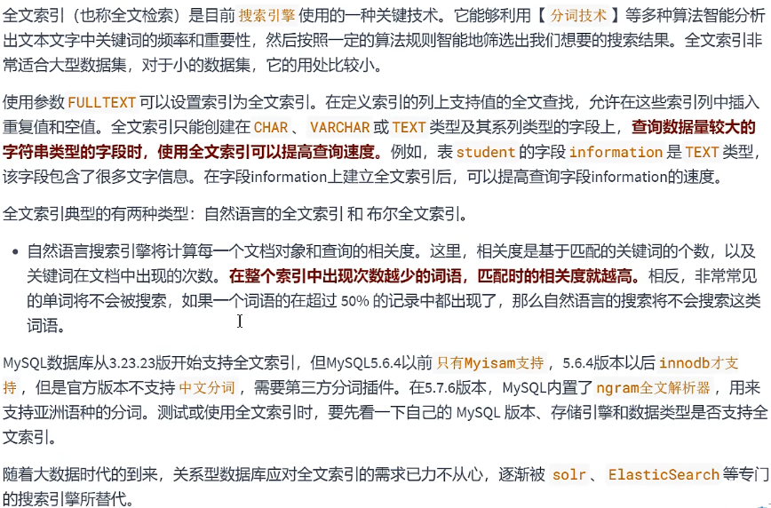
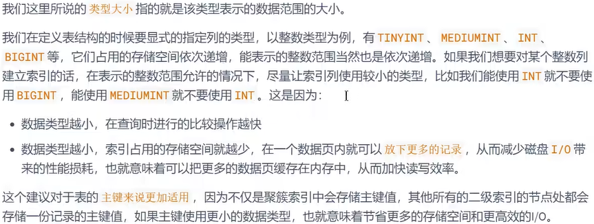
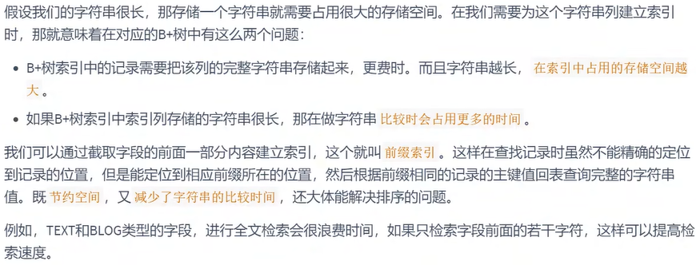

# 🐊 MySQL索引进阶 - 索引的创建与设计原则

---

# 索引的创建与设计原则

## 1. 索引的声明与使用

### 1.1 索引的分类

MySQL的索引包括普通索引、唯一性索引、全文索引、单列索引、多列索引和空间索引等。

从 功能逻辑 上说，索引主要有 4 种，分别是普通索引、唯一索引、主键索引、全文索引。 

按照 物理实现方式 ，索引可以分为 2 种：聚簇索引和非聚簇索引。 

按照 作用字段个数 进行划分，分成单列索引和联合索引。

**1. 普通索引**


**2. 唯一性索引**


**3. 主键索引**


**4. 单列索引**


**5. 多列 (组合、联合) 索引**


**6. 全文检索**



**7. 补充：空间索引**


**小结：不同的存储引擎支持的索引类型也不一样 **

InnoDB ：支持 B-tree、Full-text 等索引，不支持 Hash 索引； 

MyISAM ： 支持 B-tree、Full-text 等索引，不支持 Hash 索引； 

Memory ：支持 B-tree、Hash 等 索引，不支持 Full-text 索引；

NDB ：支持 Hash 索引，不支持 B-tree、Full-text 等索引； 

Archive ：不支 持 B-tree、Hash、Full-text 等索引；

### 1.2 创建索引

MySQL支持多种方法在单个或多个列上创建索引：在创建表的定义语句 CREATE TABLE 中指定索引列，使用 ALTER TABLE 语句在存在的表上创建索引，或者使用 CREATE INDEX 语句在已存在的表上添加索引。

#### 1. 创建表的时候创建索引

使用CREATE TABLE创建表时，除了可以定义列的数据类型外，还可以定义主键约束、外键约束或者唯一性约束，而不论创建哪种约束，在定义约束的同时相当于在指定列上创建了一个索引。

举例：

```mysql
CREATE TABLE dept(
dept_id INT PRIMARY KEY AUTO_INCREMENT,
dept_name VARCHAR(20)
);

CREATE TABLE emp(
emp_id INT PRIMARY KEY AUTO_INCREMENT,
emp_name VARCHAR(20) UNIQUE,
dept_id INT,
CONSTRAINT emp_dept_id_fk FOREIGN KEY(dept_id) REFERENCES dept(dept_id)
)
```

但是，如果显式创建表时创建索引的话，基本语法格式如下：

```mysql
CREATE TABLE table_name [col_name data_type]
[UNIQUE | FULLTEXT | SPATIAL] [INDEX | KEY] [index_name] (col_name [length]) [ASC |
DESC]
```

* UNIQUE 、 FULLTEXT 和 SPATIAL 为可选参数，分别表示唯一索引、全文索引和空间索引； 
* INDEX 与 KEY 为同义词，两者的作用相同，用来指定创建索引； 
* index_name 指定索引的名称，为可选参数，如果不指定，那么MySQL默认col_name为索引名； 
* col_name 为需要创建索引的字段列，该列必须从数据表中定义的多个列中选择； 
* length 为可选参数，表示索引的长度，只有字符串类型的字段才能指定索引长度； 
* ASC 或 DESC 指定升序或者降序的索引值存储。

**1. 创建普通索引**

在book表中的year_publication字段上建立普通索引，SQL语句如下：

```mysql
CREATE TABLE book(
book_id INT ,
book_name VARCHAR(100),
authors VARCHAR(100),
info VARCHAR(100) ,
comment VARCHAR(100),
year_publication YEAR,
INDEX(year_publication)
);
```

**2. 创建唯一索引**

```mysql
CREATE TABLE test1(
id INT NOT NULL,
name varchar(30) NOT NULL,
UNIQUE INDEX uk_idx_id(id)
);
```

该语句执行完毕之后，使用SHOW CREATE TABLE查看表结构：

```mysql
SHOW INDEX FROM test1 \G
```

**3. 主键索引**

设定为主键后数据库会自动建立索引，innodb为聚簇索引，语法：

* 随表一起建索引：

```mysql
CREATE TABLE student (
id INT(10) UNSIGNED AUTO_INCREMENT ,
student_no VARCHAR(200),
student_name VARCHAR(200),
PRIMARY KEY(id)
);
```

* 删除主键索引：

```mysql
ALTER TABLE student
drop PRIMARY KEY;
```

* 修改主键索引：必须先删除掉(drop)原索引，再新建(add)索引

**4. 创建单列索引**

引举:

```mysql
CREATE TABLE test2(
id INT NOT NULL,
name CHAR(50) NULL,
INDEX single_idx_name(name(20))
);
```

该语句执行完毕之后，使用SHOW CREATE TABLE查看表结构：

```mysql
SHOW INDEX FROM test2 \G
```

**5. 创建组合索引**

举例：创建表test3，在表中的id、name和age字段上建立组合索引，SQL语句如下：

```mysql
CREATE TABLE test3(
id INT(11) NOT NULL,
name CHAR(30) NOT NULL,
age INT(11) NOT NULL,
info VARCHAR(255),
INDEX multi_idx(id,name,age)
);
```

该语句执行完毕之后，使用SHOW INDEX 查看：

```mysql
SHOW INDEX FROM test3 \G
```

在test3表中，查询id和name字段，使用EXPLAIN语句查看索引的使用情况：

```mysql
EXPLAIN SELECT * FROM test3 WHERE id=1 AND name='songhongkang' \G
```

可以看到，查询id和name字段时，使用了名称为MultiIdx的索引，如果查询 (name, age) 组合或者单独查询name和age字段，会发现结果中possible_keys和key值为NULL, 并没有使用在t3表中创建的索引进行查询。

**6. 创建全文索引**

FULLTEXT全文索引可以用于全文检索，并且只为 `CHAR` 、`VARCHAR` 和 `TEXT` 列创建索引。索引总是对整个列进行，不支持局部 (前缀) 索引。

举例1：创建表test4，在表中的info字段上建立全文索引，SQL语句如下：

```mysql
CREATE TABLE test4(
id INT NOT NULL,
name CHAR(30) NOT NULL,
age INT NOT NULL,
info VARCHAR(255),
FULLTEXT INDEX futxt_idx_info(info)
) ENGINE=MyISAM;
```

> 在MySQL5.7及之后版本中可以不指定最后的ENGINE了，因为在此版本中InnoDB支持全文索引。

语句执行完毕之后，使用SHOW CREATE TABLE查看表结构：

```mysql
SHOW INDEX FROM test4 \G
```

由结果可以看到，info字段上已经成功建立了一个名为futxt_idx_info的FULLTEXT索引。

举例2：

```mysql
CREATE TABLE articles (
id INT UNSIGNED AUTO_INCREMENT PRIMARY KEY,
title VARCHAR (200),
body TEXT,
FULLTEXT index (title, body)
) ENGINE = INNODB;
```

创建了一个给title和body字段添加全文索引的表。

举例3：

```mysql
CREATE TABLE `papers` (
`id` int(10) unsigned NOT NULL AUTO_INCREMENT,
`title` varchar(200) DEFAULT NULL,
`content` text,
PRIMARY KEY (`id`),
FULLTEXT KEY `title` (`title`,`content`)
) ENGINE=MyISAM DEFAULT CHARSET=utf8;
```

不同于like方式的的查询：

```mysql
SELECT * FROM papers WHERE content LIKE ‘%查询字符串%’;
```

全文索引用match+against方式查询：

```mysql
SELECT * FROM papers WHERE MATCH(title,content) AGAINST (‘查询字符串’);
```

明显的提高查询效率。

> 注意点 
>
> 1. 使用全文索引前，搞清楚版本支持情况； 
> 2. 全文索引比 like + % 快 N 倍，但是可能存在精度问题；
> 3. 如果需要全文索引的是大量数据，建议先添加数据，再创建索引。

**7. 创建空间索引**

空间索引创建中，要求空间类型的字段必须为 非空 。

举例：创建表test5，在空间类型为GEOMETRY的字段上创建空间索引，SQL语句如下：

```mysql
CREATE TABLE test5(
geo GEOMETRY NOT NULL,
SPATIAL INDEX spa_idx_geo(geo)
) ENGINE=MyISAM;
```

该语句执行完毕之后，使用SHOW CREATE TABLE查看表结构：

```mysql
SHOW INDEX FROM test5 \G
```

可以看到，test5表的geo字段上创建了名称为spa_idx_geo的空间索引。注意创建时指定空间类型字段值的非空约束，并且表的存储引擎为MyISAM。

#### 2. 在已经存在的表上创建索引

在已经存在的表中创建索引可以使用ALTER TABLE语句或者CREATE INDEX语句。

**1. 使用ALTER TABLE语句创建索引** ALTER TABLE语句创建索引的基本语法如下：

```mysql
ALTER TABLE table_name ADD [UNIQUE | FULLTEXT | SPATIAL] [INDEX | KEY]
[index_name] (col_name[length],...) [ASC | DESC]
```

**2. 使用CREATE INDEX创建索引** CREATE INDEX语句可以在已经存在的表上添加索引，在MySQL中， CREATE INDEX被映射到一个ALTER TABLE语句上，基本语法结构为：

```mysql
CREATE [UNIQUE | FULLTEXT | SPATIAL] INDEX index_name
ON table_name (col_name[length],...) [ASC | DESC]
```

### 1.3 删除索引

**1. 使用ALTER TABLE删除索引**  ALTER TABLE删除索引的基本语法格式如下：

```mysql
ALTER TABLE table_name DROP INDEX index_name;
```

**2. 使用DROP INDEX语句删除索引** DROP INDEX删除索引的基本语法格式如下：

```mysql
DROP INDEX index_name ON table_name;
```

> 提示: 删除表中的列时，如果要删除的列为索引的组成部分，则该列也会从索引中删除。如果组成索引的所有列都被删除，则整个索引将被删除。

## 2. MySQL8.0索引新特性

### 2.1 支持降序索引

降序索引以降序存储键值。虽然在语法上，从MySQL 4版本开始就已经支持降序索引的语法了，但实际上DESC定义是被忽略的，直到MySQL 8.x版本才开始真正支持降序索引 (仅限于InnoDBc存储引擎)。

MySQL在8.0版本之前创建的仍然是升序索引，使用时进行反向扫描，这大大降低了数据库的效率。在某些场景下，降序索引意义重大。例如，如果一个查询，需要对多个列进行排序，且顺序要求不一致，那么使用降序索引将会避免数据库使用额外的文件排序操作，从而提高性能。

举例：分别在MySQL 5.7版本和MySQL 8.0版本中创建数据表ts1，结果如下：

```mysql
CREATE TABLE ts1(a int,b int,index idx_a_b(a,b desc));
```

在MySQL 5.7版本中查看数据表ts1的结构，结果如下:


从结果可以看出，索引仍然是默认的升序

在MySQL 8.0版本中查看数据表ts1的结构，结果如下：


从结果可以看出，索引已经是降序了。下面继续测试降序索引在执行计划中的表现。

分别在MySQL 5.7版本和MySQL 8.0版本的数据表ts1中插入800条随机数据，执行语句如下：

```mysql
DELIMITER //
CREATE PROCEDURE ts_insert()
BEGIN
	DECLARE i INT DEFAULT 1;
	WHILE i < 800
	DO
		insert into ts1 select rand()*80000, rand()*80000;
		SET i = i+1;
	END WHILE;
	commit;
END //
DELIMITER;

# 调用
CALL ts_insert();
```

在MySQL 5.7版本中查看数据表ts1的执行计划，结果如下:

```mysql
EXPLAIN SELECT * FROM ts1 ORDER BY a, b DESC LIMIT 5;
```

在MySQL 8.0版本中查看数据表 ts1 的执行计划。

从结果可以看出，修改后MySQL 5.7 的执行计划要明显好于MySQL 8.0。

### 2.2 隐藏索引

在MySQL 5.7版本及之前，只能通过显式的方式删除索引。此时，如果发展删除索引后出现错误，又只能通过显式创建索引的方式将删除的索引创建回来。如果数据表中的数据量非常大，或者数据表本身比较 大，这种操作就会消耗系统过多的资源，操作成本非常高。

从MySQL 8.x开始支持 隐藏索引（invisible indexes） ，只需要将待删除的索引设置为隐藏索引，使 查询优化器不再使用这个索引（即使使用force index（强制使用索引），优化器也不会使用该索引）， 确认将索引设置为隐藏索引后系统不受任何响应，就可以彻底删除索引。 这种通过先将索引设置为隐藏索 引，再删除索引的方式就是软删除。

同时，如果你想验证某个索引删除之后的 `查询性能影响`，就可以暂时先隐藏该索引。

> 注意：
>
> 主键不能被设置为隐藏索引。当表中没有显式主键时，表中第一个唯一非空索引会成为隐式主键，也不能设置为隐藏索引。

索引默认是可见的，在使用CREATE TABLE, CREATE INDEX 或者 ALTER TABLE 等语句时可以通过 `VISIBLE` 或者 `INVISIBLE` 关键词设置索引的可见性。

**1. 创建表时直接创建**

在MySQL中创建隐藏索引通过SQL语句INVISIBLE来实现，其语法形式如下：

```mysql
CREATE TABLE tablename(
propname1 type1[CONSTRAINT1],
propname2 type2[CONSTRAINT2],
……
propnamen typen,
INDEX [indexname](propname1 [(length)]) INVISIBLE
);
```

上述语句比普通索引多了一个关键字INVISIBLE，用来标记索引为不可见索引。

**2. 在已经存在的表上创建**

可以为已经存在的表设置隐藏索引，其语法形式如下：

```mysql
CREATE INDEX indexname
ON tablename(propname[(length)]) INVISIBLE;
```

**3. 通过ALTER TABLE语句创建**

语法形式如下：

```mysql
ALTER TABLE tablename
ADD INDEX indexname (propname [(length)]) INVISIBLE;
```

**4. 切换索引可见状态**

已存在的索引可通过如下语句切换可见状态：

```mysql
ALTER TABLE tablename ALTER INDEX index_name INVISIBLE; #切换成隐藏索引
ALTER TABLE tablename ALTER INDEX index_name VISIBLE; #切换成非隐藏索引
```

如果将index_cname索引切换成可见状态，通过explain查看执行计划，发现优化器选择了index_cname索引。

> 注意 当索引被隐藏时，它的内容仍然是和正常索引一样实时更新的。如果一个索引需要长期被隐藏，那么可以将其删除，因为索引的存在会影响插入、更新和删除的性能。

通过设置隐藏索引的可见性可以查看索引对调优的帮助。

**5. 使隐藏索引对查询优化器可见**

在MySQL 8.x版本中，为索引提供了一种新的测试方式，可以通过查询优化器的一个开关 (use_invisible_indexes) 来打开某个设置，使隐藏索引对查询优化器可见。如果use_invisible_indexes 设置为off (默认)，优化器会忽略隐藏索引。如果设置为on，即使隐藏索引不可见，优化器在生成执行计 划时仍会考虑使用隐藏索引。

（1）在MySQL命令行执行如下命令查看查询优化器的开关设置。

```mysql
mysql> select @@optimizer_switch \G
```

在输出的结果信息中找到如下属性配置。

```mysql
use_invisible_indexes=off
```

此属性配置值为off，说明隐藏索引默认对查询优化器不可见。

（2）使隐藏索引对查询优化器可见，需要在MySQL命令行执行如下命令：

```mysql
mysql> set session optimizer_switch="use_invisible_indexes=on";
Query OK, 0 rows affected (0.00 sec)
```

SQL语句执行成功，再次查看查询优化器的开关设置。

```mysql
mysql> select @@optimizer_switch \G
*************************** 1. row ***************************
@@optimizer_switch:
index_merge=on,index_merge_union=on,index_merge_sort_union=on,index_merge_
intersection=on,engine_condition_pushdown=on,index_condition_pushdown=on,mrr=on,mrr_co
st_based=on,block_nested_loop=on,batched_key_access=off,materialization=on,semijoin=on
,loosescan=on,firstmatch=on,duplicateweedout=on,subquery_materialization_cost_based=on
,use_index_extensions=on,condition_fanout_filter=on,derived_merge=on,use_invisible_ind
exes=on,skip_scan=on,hash_join=on
1 row in set (0.00 sec)
```

此时，在输出结果中可以看到如下属性配置。

```mysql
use_invisible_indexes=on
```

use_invisible_indexes属性的值为on，说明此时隐藏索引对查询优化器可见。

（3）使用EXPLAIN查看以字段invisible_column作为查询条件时的索引使用情况。

```mysql
explain select * from classes where cname = '高一2班';
```

查询优化器会使用隐藏索引来查询数据。

（4）如果需要使隐藏索引对查询优化器不可见，则只需要执行如下命令即可。

```mysql
mysql> set session optimizer_switch="use_invisible_indexes=off";
Query OK, 0 rows affected (0.00 sec)
```

再次查看查询优化器的开关设置。

```mysql
mysql> select @@optimizer_switch \G
```

此时，use_invisible_indexes属性的值已经被设置为“off”。

## 3. 索引的设计原则

为了使索引的使用效率更高，在创建索引时，必须考虑在哪些字段上创建索引和创建什么类型的索引。**索引设计不合理或者缺少索引都会对数据库和应用程序的性能造成障碍。**高效的索引对于获得良好的性能非常重要。设计索引时，应该考虑相应准则。

### 3.1 数据准备

**第1步：创建数据库、创建表**

```mysql
CREATE DATABASE atguigudb1;
USE atguigudb1;
#1.创建学生表和课程表
CREATE TABLE `student_info` (
`id` INT(11) NOT NULL AUTO_INCREMENT,
`student_id` INT NOT NULL ,
`name` VARCHAR(20) DEFAULT NULL,
`course_id` INT NOT NULL ,
`class_id` INT(11) DEFAULT NULL,
`create_time` DATETIME DEFAULT CURRENT_TIMESTAMP ON UPDATE CURRENT_TIMESTAMP,
PRIMARY KEY (`id`)
) ENGINE=INNODB AUTO_INCREMENT=1 DEFAULT CHARSET=utf8;

CREATE TABLE `course` (
`id` INT(11) NOT NULL AUTO_INCREMENT,
`course_id` INT NOT NULL ,
`course_name` VARCHAR(40) DEFAULT NULL,
PRIMARY KEY (`id`)
) ENGINE=INNODB AUTO_INCREMENT=1 DEFAULT CHARSET=utf8;
```

**第2步：创建模拟数据必需的存储函数**

```mysql
#函数1：创建随机产生字符串函数
DELIMITER //
CREATE FUNCTION rand_string(n INT)
	RETURNS VARCHAR(255) #该函数会返回一个字符串
BEGIN
	DECLARE chars_str VARCHAR(100) DEFAULT
'abcdefghijklmnopqrstuvwxyzABCDEFJHIJKLMNOPQRSTUVWXYZ';
	DECLARE return_str VARCHAR(255) DEFAULT '';
    DECLARE i INT DEFAULT 0;
    WHILE i < n DO
    	SET return_str =CONCAT(return_str,SUBSTRING(chars_str,FLOOR(1+RAND()*52),1));
    	SET i = i + 1;
    END WHILE;
    RETURN return_str;
END //
DELIMITER ;
```

```mysql
#函数2：创建随机数函数
DELIMITER //
CREATE FUNCTION rand_num (from_num INT ,to_num INT) RETURNS INT(11)
BEGIN
DECLARE i INT DEFAULT 0;
SET i = FLOOR(from_num +RAND()*(to_num - from_num+1)) ;
RETURN i;
END //
DELIMITER ;
```

创建函数，假如报错：

```mysql
This function has none of DETERMINISTIC......
```

由于开启过慢查询日志bin-log, 我们就必须为我们的function指定一个参数。

主从复制，主机会将写操作记录在bin-log日志中。从机读取bin-log日志，执行语句来同步数据。如果使 用函数来操作数据，会导致从机和主键操作时间不一致。所以，默认情况下，mysql不开启创建函数设置。

* 查看mysql是否允许创建函数：

```mysql
show variables like 'log_bin_trust_function_creators';
```

* 命令开启：允许创建函数设置：

```mysql
set global log_bin_trust_function_creators=1; # 不加global只是当前窗口有效。
```

* mysqld重启，上述参数又会消失。永久方法：

  * windows下：my.ini[mysqld]加上：

    ```mysql
    log_bin_trust_function_creators=1
    ```

  * linux下：/etc/my.cnf下my.cnf[mysqld]加上：

    ```mysql
    log_bin_trust_function_creators=1
    ```

**第3步：创建插入模拟数据的存储过程**

```mysql
# 存储过程1：创建插入课程表存储过程
DELIMITER //
CREATE PROCEDURE insert_course( max_num INT )
BEGIN
DECLARE i INT DEFAULT 0;
SET autocommit = 0; #设置手动提交事务
REPEAT #循环
SET i = i + 1; #赋值
INSERT INTO course (course_id, course_name ) VALUES
(rand_num(10000,10100),rand_string(6));
UNTIL i = max_num
END REPEAT;
COMMIT; #提交事务
END //
DELIMITER ;
```

```mysql
# 存储过程2：创建插入学生信息表存储过程
DELIMITER //
CREATE PROCEDURE insert_stu( max_num INT )
BEGIN
DECLARE i INT DEFAULT 0;
SET autocommit = 0; #设置手动提交事务
REPEAT #循环
SET i = i + 1; #赋值
INSERT INTO student_info (course_id, class_id ,student_id ,NAME ) VALUES
(rand_num(10000,10100),rand_num(10000,10200),rand_num(1,200000),rand_string(6));
UNTIL i = max_num
END REPEAT;
COMMIT; #提交事务
END //
DELIMITER ;
```

**第4步：调用存储过程**

```mysql
CALL insert_course(100);
```

```mysql
CALL insert_stu(1000000);
```

### 3.2 哪些情况适合创建索引

#### 1. 字段的数值有唯一性的限制


> 业务上具有唯一特性的字段，即使是组合字段，也必须建成唯一索引。（来源：Alibaba） 说明：不要以为唯一索引影响了 insert 速度，这个速度损耗可以忽略，但提高查找速度是明显的。

#### 2. 频繁作为 WHERE 查询条件的字段

某个字段在SELECT语句的 WHERE 条件中经常被使用到，那么就需要给这个字段创建索引了。尤其是在 数据量大的情况下，创建普通索引就可以大幅提升数据查询的效率。 

比如student_info数据表（含100万条数据），假设我们想要查询 student_id=123110 的用户信息。

#### 3. 经常 GROUP BY 和 ORDER BY 的列

索引就是让数据按照某种顺序进行存储或检索，因此当我们使用 GROUP BY 对数据进行分组查询，或者使用 ORDER BY 对数据进行排序的时候，就需要对分组或者排序的字段进行索引 。如果待排序的列有多个，那么可以在这些列上建立组合索引 。

#### 4. UPDATE、DELETE 的 WHERE 条件列

对数据按照某个条件进行查询后再进行 UPDATE 或 DELETE 的操作，如果对 WHERE 字段创建了索引，就能大幅提升效率。原理是因为我们需要先根据 WHERE 条件列检索出来这条记录，然后再对它进行更新或删除。**如果进行更新的时候，更新的字段是非索引字段，提升的效率会更明显，这是因为非索引字段更新不需要对索引进行维护。**

#### 5.DISTINCT 字段需要创建索引

有时候我们需要对某个字段进行去重，使用 DISTINCT，那么对这个字段创建索引，也会提升查询效率。 

比如，我们想要查询课程表中不同的 student_id 都有哪些，如果我们没有对 student_id 创建索引，执行 SQL 语句：

```mysql
SELECT DISTINCT(student_id) FROM `student_info`;
```

运行结果（600637 条记录，运行时间 0.683s ）

如果我们对 student_id 创建索引，再执行 SQL 语句：

```mysql
SELECT DISTINCT(student_id) FROM `student_info`;
```

运行结果（600637 条记录，运行时间 0.010s ）

你能看到 SQL 查询效率有了提升，同时显示出来的 student_id 还是按照递增的顺序 进行展示的。这是因为索引会对数据按照某种顺序进行排序，所以在去重的时候也会快很多。

#### 6. 多表 JOIN 连接操作时，创建索引注意事项

首先， `连接表的数量尽量不要超过 3 张` ，因为每增加一张表就相当于增加了一次嵌套的循环，数量级增 长会非常快，严重影响查询的效率。 

其次， `对 WHERE 条件创建索引` ，因为 WHERE 才是对数据条件的过滤。如果在数据量非常大的情况下， 没有 WHERE 条件过滤是非常可怕的。 

最后， `对用于连接的字段创建索引` ，并且该字段在多张表中的 类型必须一致 。比如 course_id 在 student_info 表和 course 表中都为 int(11) 类型，而不能一个为 int 另一个为 varchar 类型。

举个例子，如果我们只对 student_id 创建索引，执行 SQL 语句：

```mysql
SELECT s.course_id, name, s.student_id, c.course_name
FROM student_info s JOIN course c
ON s.course_id = c.course_id
WHERE name = '462eed7ac6e791292a79';
```

运行结果（1 条数据，运行时间 0.189s ）

这里我们对 name 创建索引，再执行上面的 SQL 语句，运行时间为 0.002s 。

#### 7. 使用列的类型小的创建索引



#### 8. 使用字符串前缀创建索引



创建一张商户表，因为地址字段比较长，在地址字段上建立前缀索引

```mysql
create table shop(address varchar(120) not null);
alter table shop add index(address(12));
```

问题是，截取多少呢？截取得多了，达不到节省索引存储空间的目的；截取得少了，重复内容太多，字 段的散列度(选择性)会降低。怎么计算不同的长度的选择性呢？

先看一下字段在全部数据中的选择度：

```mysql
select count(distinct address) / count(*) from shop
```

通过不同长度去计算，与全表的选择性对比：

公式：

```mysql
count(distinct left(列名, 索引长度))/count(*)
```

例如：

```mysql
select count(distinct left(address,10)) / count(*) as sub10, -- 截取前10个字符的选择度
count(distinct left(address,15)) / count(*) as sub11, -- 截取前15个字符的选择度
count(distinct left(address,20)) / count(*) as sub12, -- 截取前20个字符的选择度
count(distinct left(address,25)) / count(*) as sub13 -- 截取前25个字符的选择度
from shop;
```

> 越接近于1越好，说明越有区分度

**引申另一个问题：索引列前缀对排序的影响**

如果使用了索引列前缀，比方说前边只把address列的 `前12个字符` 放到了二级索引中，下边这个查询可能就有点尴尬了：

```mysql
SELECT * FROM shop
ORDER BY address
LIMIT 12;
```

因为二级索引中不包含完整的address列信息，所以无法对前12个字符相同，后边的字符不同的记录进行排序，也就是使用索引列前缀的方式 `无法支持使用索引排序` ，只能使用文件排序。

**拓展：Alibaba《Java开发手册》**

【 强制 】在 varchar 字段上建立索引时，必须指定索引长度，没必要对全字段建立索引，根据实际文本 区分度决定索引长度。 

说明：索引的长度与区分度是一对矛盾体，一般对字符串类型数据，长度为 20 的索引，区分度会高达 90% 以上 ，可以使用 count(distinct left(列名, 索引长度))/count(*)的区分度来确定。

#### 9. 区分度高(散列性高)的列适合作为索引

`列的基数` 指的是某一列中不重复数据的个数，比方说某个列包含值 `2, 5, 8, 2, 5, 8, 2, 5, 8`，虽然有`9`条记录，但该列的基数却是3。也就是说**在记录行数一定的情况下，列的基数越大，该列中的值越分散；列的基数越小，该列中的值越集中。**这个列的基数指标非常重要，直接影响我们是否能有效的利用索引。最好为列的基数大的列简历索引，为基数太小的列的简历索引效果可能不好。

可以使用公式`select count(distinct a) / count(*) from t1` 计算区分度，越接近1越好，一般超过33%就算比较高效的索引了。

扩展：联合索引把区分度搞(散列性高)的列放在前面。

#### 10. 使用最频繁的列放到联合索引的左侧

这样也可以较少的建立一些索引。同时，由于"最左前缀原则"，可以增加联合索引的使用率。

#### 11. 在多个字段都要创建索引的情况下，联合索引优于单值索引

### 3.3 限制索引的数目


### 3.4 哪些情况不适合创建索引

#### 1. 在where中使用不到的字段，不要设置索引

WHERE条件 (包括 GROUP BY、ORDER BY) 里用不到的字段不需要创建索引，索引的价值是快速定位，如果起不到定位的字段通常是不需要创建索引的。举个例子：

```mysql
SELECT course_id, student_id, create_time
FROM student_info
WHERE student_id = 41251;
```

因为我们是按照 student_id 来进行检索的，所以不需要对其他字段创建索引，即使这些字段出现在SELECT字段中。

#### 2. 数据量小的表最好不要使用索引

如果表记录太少，比如少于1000个，那么是不需要创建索引的。表记录太少，是否创建索引 `对查询效率的影响并不大`。甚至说，查询花费的时间可能比遍历索引的时间还要短，索引可能不会产生优化效果。

举例：创建表1：

```mysql
CREATE TABLE t_without_index(
a INT PRIMARY KEY AUTO_INCREMENT,
b INT
);
```

提供存储过程1：

```mysql
#创建存储过程
DELIMITER //
CREATE PROCEDURE t_wout_insert()
BEGIN
    DECLARE i INT DEFAULT 1;
    WHILE i <= 900
    DO
        INSERT INTO t_without_index(b) SELECT RAND()*10000;
        SET i = i + 1;
    END WHILE;
    COMMIT;
END //
DELIMITER ;

#调用
CALL t_wout_insert()
```

创建表2：

```mysql
CREATE TABLE t_with_index(
a INT PRIMARY KEY AUTO_INCREMENT,
b INT,
INDEX idx_b(b)
);
```

创建存储过程2：

```mysql
#创建存储过程
DELIMITER //
CREATE PROCEDURE t_with_insert()
BEGIN
    DECLARE i INT DEFAULT 1;
    WHILE i <= 900
    DO
        INSERT INTO t_with_index(b) SELECT RAND()*10000;
        SET i = i + 1;
    END WHILE;
    COMMIT;
END //
DELIMITER ;

#调用
CALL t_with_insert();
```

查询对比：

```mysql
mysql> select * from t_without_index where b = 9879;
+------+------+
| a | b |
+------+------+
| 1242 | 9879 |
+------+------+
1 row in set (0.00 sec)

mysql> select * from t_with_index where b = 9879;
+-----+------+
| a | b |
+-----+------+
| 112 | 9879 |
+-----+------+
1 row in set (0.00 sec)
```

你能看到运行结果相同，但是在数据量不大的情况下，索引就发挥不出作用了。

> 结论：在数据表中的数据行数比较少的情况下，比如不到 1000 行，是不需要创建索引的。

#### 3. 有大量重复数据的列上不要建立索引

在条件表达式中经常用到的不同值较多的列上建立索引，但字段中如果有大量重复数据，也不用创建索引。比如在学生表的"性别"字段上只有“男”与“女”两个不同值，因此无须建立索引。如果建立索引，不但不会提高查询效率，反而会`严重降低数据更新速度`。

举例1：要在 100 万行数据中查找其中的 50 万行（比如性别为男的数据），一旦创建了索引，你需要先 访问 50 万次索引，然后再访问 50 万次数据表，这样加起来的开销比不使用索引可能还要大。

举例2：假设有一个学生表，学生总数为 100 万人，男性只有 10 个人，也就是占总人口的 10 万分之 1。

学生表 student_gender 结构如下。其中数据表中的 student_gender 字段取值为 0 或 1，0 代表女性，1 代表男性。

```mysql
CREATE TABLE student_gender(
    student_id INT(11) NOT NULL,
    student_name VARCHAR(50) NOT NULL,
    student_gender TINYINT(1) NOT NULL,
    PRIMARY KEY(student_id)
)ENGINE = INNODB;
```

如果我们要筛选出这个学生表中的男性，可以使用：

```mysql
SELECT * FROM student_gender WHERE student_gender = 1;
```

> 结论：当数据重复度大，比如 高于 10% 的时候，也不需要对这个字段使用索引。

#### 4.  避免对经常更新的表创建过多的索引

第一层含义：频繁更新的字段不一定要创建索引。因为更新数据的时候，也需要更新索引，如果索引太多，在更新索引的时候也会造成负担，从而影响效率。

第二层含义：避免对经常更新的表创建过多的索引，并且索引中的列尽可能少。此时，虽然提高了查询速度，同时却降低更新表的速度。

#### 5. 不建议用无序的值作为索引

例如身份证、UUID(在索引比较时需要转为ASCII，并且插入时可能造成页分裂)、MD5、HASH、无序长字 符串等。

#### 6. 删除不再使用或者很少使用的索引

表中的数据被大量更新，或者数据的使用方式被改变后，原有的一些索引可能不再需要。数据库管理员应当定期找出这些索引，将它们删除，从而减少索引对更新操作的影响。

#### 7. 不要定义夯余或重复的索引

① 冗余索引 

举例：建表语句如下

```mysql
CREATE TABLE person_info(
    id INT UNSIGNED NOT NULL AUTO_INCREMENT,
    name VARCHAR(100) NOT NULL,
    birthday DATE NOT NULL,
    phone_number CHAR(11) NOT NULL,
    country varchar(100) NOT NULL,
    PRIMARY KEY (id),
    KEY idx_name_birthday_phone_number (name(10), birthday, phone_number),
    KEY idx_name (name(10))
);
```

我们知道，通过 idx_name_birthday_phone_number 索引就可以对 name 列进行快速搜索，再创建一 个专门针对 name 列的索引就算是一个 冗余索引 ，维护这个索引只会增加维护的成本，并不会对搜索有 什么好处。

② 重复索引 

另一种情况，我们可能会对某个列 重复建立索引 ，比方说这样：

```mysql
CREATE TABLE repeat_index_demo (
col1 INT PRIMARY KEY,
col2 INT,
UNIQUE uk_idx_c1 (col1),
INDEX idx_c1 (col1)
);
```

我们看到，col1 既是主键、又给它定义为一个唯一索引，还给它定义了一个普通索引，可是主键本身就 会生成聚簇索引，所以定义的唯一索引和普通索引是重复的，这种情况要避免。

# 参考资料

- [尚硅谷-宋红康老师，MySQL数据库教程天花板，mysql安装到mysql高级，强！硬！](https://www.bilibili.com/video/BV1iq4y1u7vj)